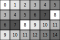
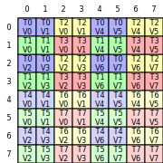

# cute-viz

A Python package for visualizing CuTe tensor layouts as SVG images.

## Installation

```bash
pip install -U git+https://github.com/NTT123/cute-viz.git
```

## Usage

```python
from cutlass import cute
from cute_viz import render_layout_svg, display_layout

@cute.jit
def main():
    # Create and render a layout to file
    layout = cute.make_layout((4, 6), stride=(3, 1))
    render_layout_svg(layout, "layout.svg")

    # Or display directly in Jupyter notebook
    display_layout(layout)

main()
```

## Example Output





## Credits

Based on the original visualization code by [Cris Cecka](https://github.com/ccecka) from [NVIDIA/cutlass#2453](https://github.com/NVIDIA/cutlass/issues/2453#issuecomment-3133409976).

## License

MIT License - see LICENSE file for details.
