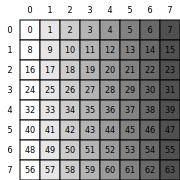

# cute-viz

A Python package for visualizing CuTe tensor layouts as SVG images.

## Installation

Install directly from GitHub:

```bash
pip install git+https://github.com/NTT123/cute-viz.git
```

## Usage

### Basic Layout Visualization

```python
from cutlass import cute
from cute_viz import render_layout_svg

@cute.jit
def visualize_basic_layout():
    # Create a layout with shape (4, 6) and stride (3, 1)
    layout = cute.make_layout((4, 6), stride=(3, 1))
    render_layout_svg(layout, "layout.svg")

visualize_basic_layout()
```

### Thread-Value Layout Visualization

```python
from cutlass import cute
from cute_viz import render_tv_layout_svg

@cute.jit
def visualize_tv_layout():
    # Create a thread-value layout
    tile_mn = (8, 8)
    tv_layout = cute.make_layout(
        shape=((2, 2, 2), (2, 2, 2)),
        stride=((1, 16, 4), (8, 2, 32))
    )
    render_tv_layout_svg(tv_layout, tile_mn, "tv_layout.svg")

visualize_tv_layout()
```

### Display in Jupyter Notebooks

#### Display from file
```python
from cute_viz import display_svg

# Display the generated SVG in a Jupyter notebook
display_svg("layout.svg")
display_svg("tv_layout.svg")
```

#### Display directly without writing to disk
```python
from cutlass import cute
from cute_viz import display_layout, display_tv_layout

@cute.jit
def display_layouts_directly():
    # Basic layout visualization - no file needed
    layout = cute.make_layout((4, 6), stride=(3, 1))
    display_layout(layout)

    # Thread-value layout visualization - no file needed
    tile_mn = (8, 8)
    tv_layout = cute.make_layout(
        shape=((2, 2, 2), (2, 2, 2)),
        stride=((1, 16, 4), (8, 2, 32))
    )
    display_tv_layout(tv_layout, tile_mn)

display_layouts_directly()
```

## Example Output

The functions generate SVG visualizations like these:

### Basic Layout Visualization


### Thread-Value Layout Visualization


## API Reference

### `render_layout_svg(layout, output_file)`

Renders a CuTe layout as an SVG grid with color-coded cells.

- **layout**: CuTe layout object
- **output_file**: Output SVG file path

### `render_tv_layout_svg(layout, tile_mn, output_file)`

Renders a CuTe thread-value (TV) layout as an SVG grid with thread and value ID labels.

- **layout**: CuTe layout object (must be rank-2 TV Layout)
- **tile_mn**: Rank-2 MN Tile
- **output_file**: Output SVG file path

### `display_svg(file_path)`

Displays an SVG file in Jupyter notebooks.

- **file_path**: Path to the SVG file to display
- **Returns**: IPython display object

### `display_layout(layout)`

Displays a CuTe layout directly in Jupyter notebooks without writing to disk.

- **layout**: CuTe layout object
- **Returns**: IPython display object

### `display_tv_layout(layout, tile_mn)`

Displays a CuTe thread-value (TV) layout directly in Jupyter notebooks without writing to disk.

- **layout**: CuTe layout object (must be rank-2 TV Layout)
- **tile_mn**: Rank-2 MN Tile
- **Returns**: IPython display object

## License

MIT License - see LICENSE file for details.
